# Live Project Showcase

Selected work from private repos, shared as sanitized summaries.

- Update model: pull-request based automation from source repos
- Privacy model: architecture + outcomes, no private source exposure
- Visuals: frontend screenshots are loaded from `assets/screenshots`
- Last generated: this file is rebuilt from `projects/*.json`

## Account Activity

- Activity window: 2022-01-01 to 2026-02-21
- Total contributions: 7,859
- Commit contributions: 7,516
- Pull requests: 77
- Issues: 3
- Reviews: 0
- Contributions (last 30 days): 108
- Active days: 299
- Longest streak: 49 days
- Estimated source LOC: 317,202
- LOC scope: Estimated from local tracked source files across showcase repos; excludes vendored directories and non-code vault content.
- Chart note: Graph window starts at 2022-01-01 and is generated from live GitHub GraphQL contribution data.

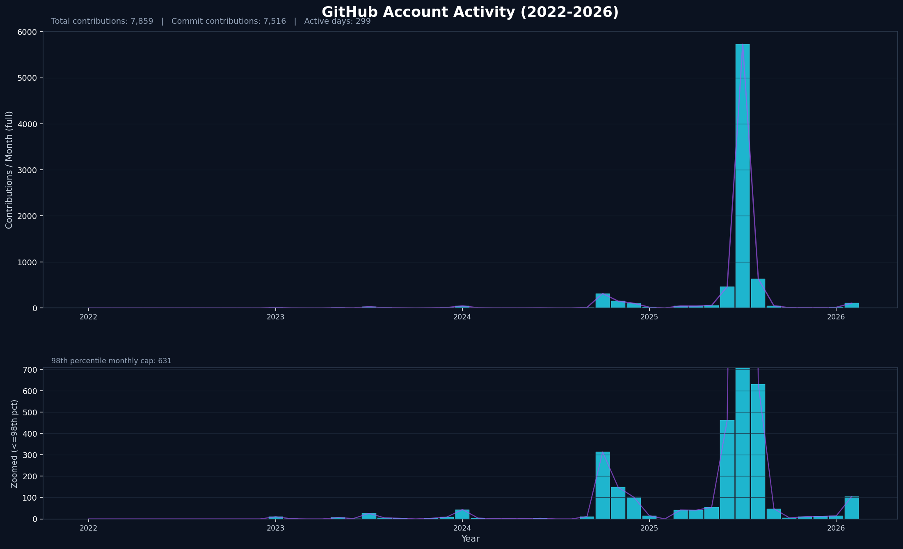

```text
Monthly Contributions
25-07 | ########################  5728
25-08 | ###                        631
25-09 | #                           48
25-10 | #                            5
25-11 | #                           10
25-12 | #                           12
26-01 | #                           14
26-02 | #                          105
```


## Projects

### genr8ive

Agentic engineering front-end that frames multi-agent workflows as a production command surface.


- Status: active
- Updated: 2026-02-21
- Stack: React, TypeScript, Convex, Clerk, Cloudflare Workers
- Impact: Established a strong foundation for multi-agent workflow composition with a distinct technical brand and interface language.
- Demo: https://genr8ive.ai/
- Details: projects/genr8ive.md
- Visibility: Core repository is private. This entry summarizes architecture and working approach without exposing proprietary source.

### OpenClaw Workspace

Operational control plane for OpenClaw workflows, memory systems, automation jobs, and system observability.

- Status: active
- Updated: 2026-02-21
- Stack: Python, JavaScript, Shell, Markdown
- Impact: Increased reliability and operator visibility for daily autonomous-agent execution and memory continuity.
- Details: projects/openclaw-workspace.md
- Visibility: Core repository is private. This entry summarizes architecture and working approach without exposing proprietary source.

### SaiBot

Managed OpenClaw platform that handles provisioning, onboarding, and lifecycle ops for non-technical users.

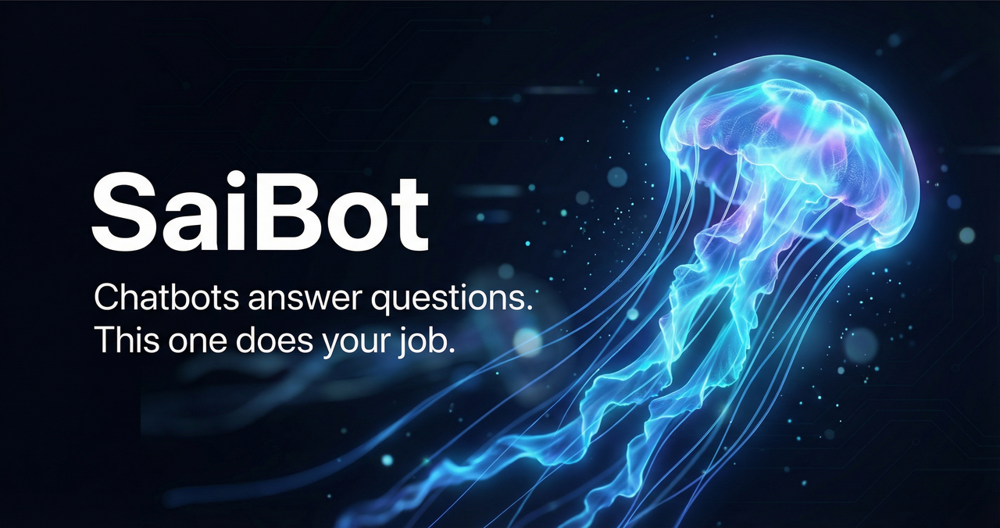

- Status: active
- Updated: 2026-02-21
- Stack: TypeScript, React, Hono, PostgreSQL
- Impact: Significantly reduced time-to-first-agent for end users while lowering operational support burden.
- Demo: https://saibot.genr8ive.ai
- Details: projects/saibot.md
- Visibility: Core repository is private. This entry summarizes architecture and working approach without exposing proprietary source.

### Gmail AI Ops

Custom AI inbox system that turned 3M+ emails into a clean, prioritized workflow with only must-see messages surfaced.

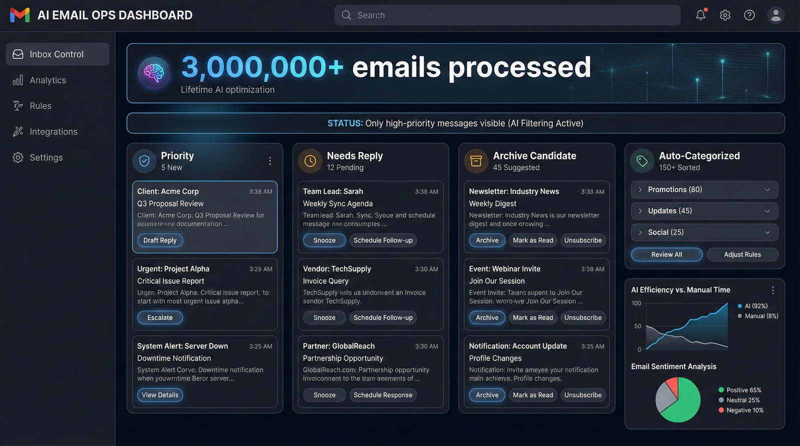

- Status: active
- Updated: 2026-02-21
- Stack: Python, Gmail API, Cloud Functions
- Impact: Converted a 3M-email backlog into a clean, AI-managed inbox where only relevant, high-value messages stay visible.
- Details: projects/gmail_ai_org.md
- Visibility: Core repository is private. This entry summarizes architecture and working approach without exposing proprietary source.

### Obsidian Knowledge Ops

Knowledge operations vault built on Obsidian for notes, clippings, archives, and durable project memory.

- Status: active
- Updated: 2026-02-21
- Stack: Markdown, Python, Shell, Obsidian
- Impact: Improved retrieval speed and long-term maintainability for high-volume notes, research captures, and project memory.
- Details: projects/obsidian.md
- Visibility: Core repository is private. This entry summarizes architecture and working approach without exposing proprietary source.

### ZipSlim Front-End Starter

Lightweight design-system starter for quickly shipping polished React marketing experiences.

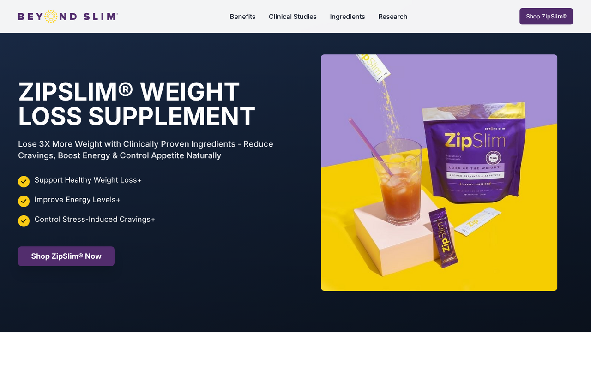

- Status: active
- Updated: 2026-02-21
- Stack: React, TypeScript, Tailwind CSS
- Impact: Reduced bootstrap time for new web projects and improved design consistency across launches.
- Details: projects/zipslim.md
- Visibility: Core repository is private. This entry summarizes architecture and working approach without exposing proprietary source.

### Browser TUI

Browser-native terminal IDE shell with persistent tmux sessions and integrated file/edit workflows.

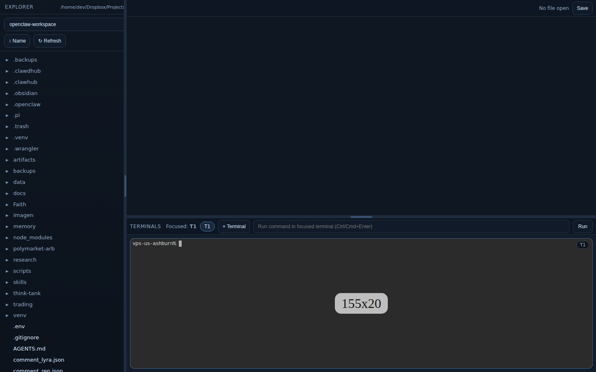

- Status: active
- Updated: 2026-02-18
- Stack: JavaScript, Node.js, tmux, Monaco
- Impact: Improved remote development ergonomics by reducing context switching across terminal, editor, and filesystem operations.
- Details: projects/browser-tui.md
- Visibility: Core repository is private. This entry summarizes architecture and working approach without exposing proprietary source.

### Polymarket Trading System

Automated Polymarket trading and arbitrage system for real-time detection, risk checks, and execution.

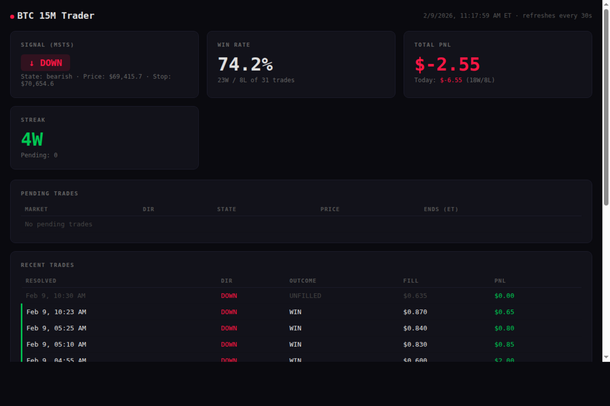

- Status: active
- Updated: 2026-02-14
- Stack: JavaScript, Node.js, WebSockets, Python
- Impact: Improved speed and discipline of opportunity detection/execution in Polymarket-focused trading workflows.
- Details: projects/polymarket-rust.md
- Visibility: Core repository is private. This entry summarizes architecture and working approach without exposing proprietary source.

### AIFunnel Web

High-conversion landing site for AI consulting and agentic engineering offers.


- Status: active
- Updated: 2026-02-06
- Stack: HTML, CSS, JavaScript, Netlify
- Impact: Created a high-clarity front door for AI consulting offers and improved how quickly prospects understand the value proposition.
- Demo: https://aifunnel.chat/
- Details: projects/aifunnel-web.md
- Visibility: Core repository is private. This entry summarizes architecture and working approach without exposing proprietary source.

### ALS Clarity

Clinical decision-support workflow that helps neurologists differentiate ALS from look-alike conditions.

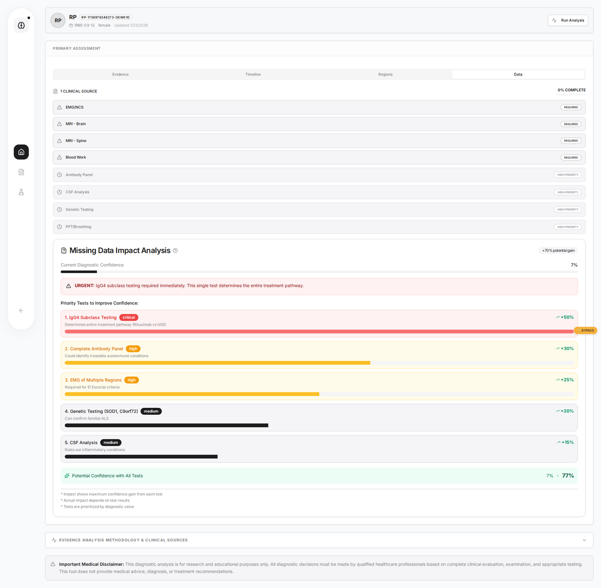

- Status: active
- Updated: 2026-02-05
- Stack: React, TypeScript, Convex, AI APIs
- Impact: Improved diagnostic workflow consistency and reduced manual synthesis burden during ALS-vs-mimic evaluations.
- Details: projects/als-clarity.md
- Visibility: Core repository is private. This entry summarizes architecture and working approach without exposing proprietary source.

### Logos Study Workspace

AI-assisted Bible study workspace for guided scripture analysis and structured note synthesis.

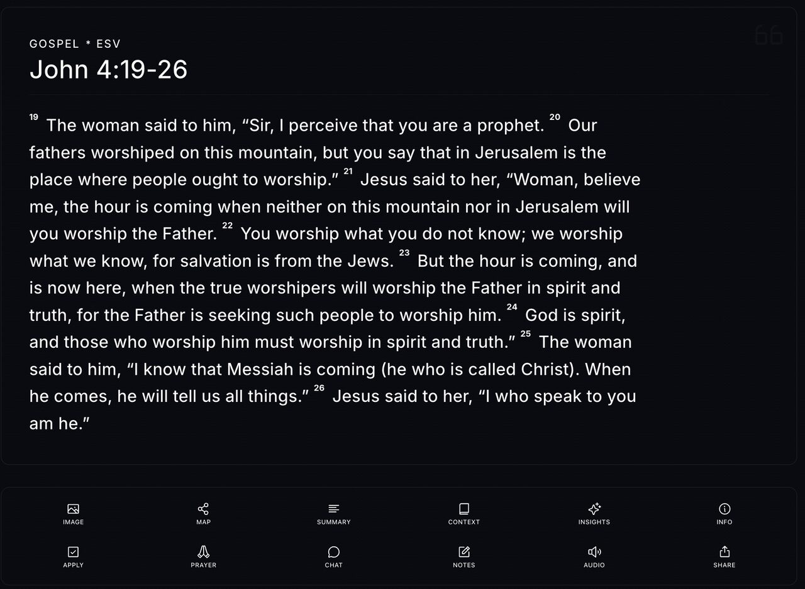

- Status: active
- Updated: 2026-02-04
- Stack: JavaScript, TypeScript, AI Studio
- Impact: Improved consistency and depth of Bible-study sessions by reducing workflow friction between reading, interpretation, and note capture.
- Details: projects/logos.md
- Visibility: Core repository is private. This entry summarizes architecture and working approach without exposing proprietary source.

### SAI Automation Core

Automation hub for recurring AI operations, monitoring jobs, and task generation workflows.

- Status: active
- Updated: 2026-01-24
- Stack: Python, TypeScript, Node.js, Automation
- Impact: Reduced manual operational overhead by turning repeatable AI/admin routines into scheduled, stateful automation.
- Details: projects/sai.md
- Visibility: Core repository is private. This entry summarizes architecture and working approach without exposing proprietary source.

### Mnemonic Learning App

Cross-platform spaced-repetition learning app focused on retention, review flow, and study consistency.

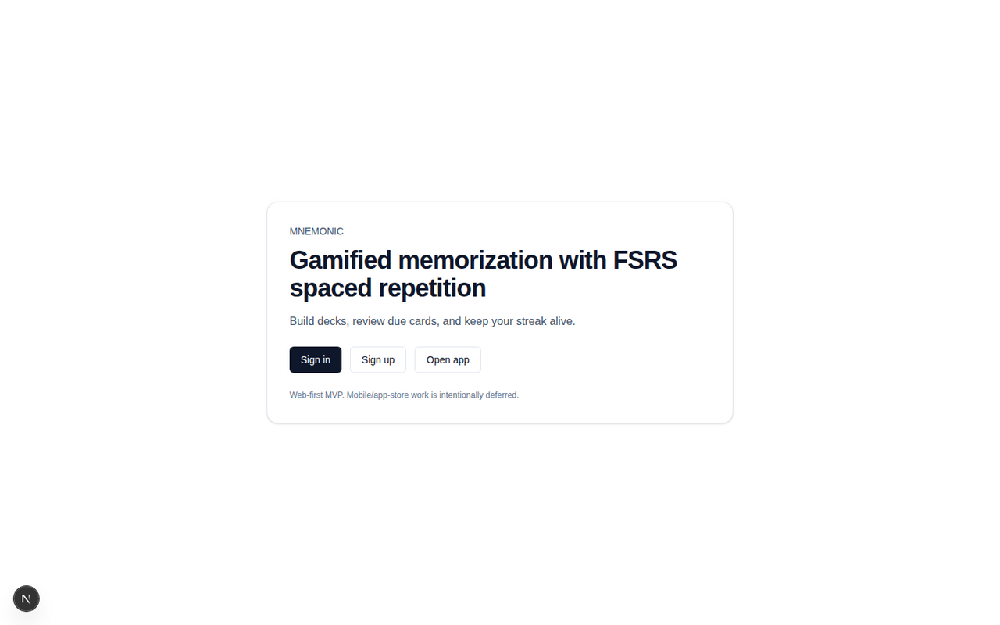

- Status: active
- Updated: 2026-01-15
- Stack: TypeScript, React Native, Expo, Web
- Impact: Established a robust foundation for habit-forming recall practice with measurable review progression.
- Details: projects/mnemonic.md
- Visibility: Core repository is private. This entry summarizes architecture and working approach without exposing proprietary source.

### ICA Client Onboarding System

Internal onboarding and delivery system for ICA client operations, SEO workflows, and implementation handoffs.

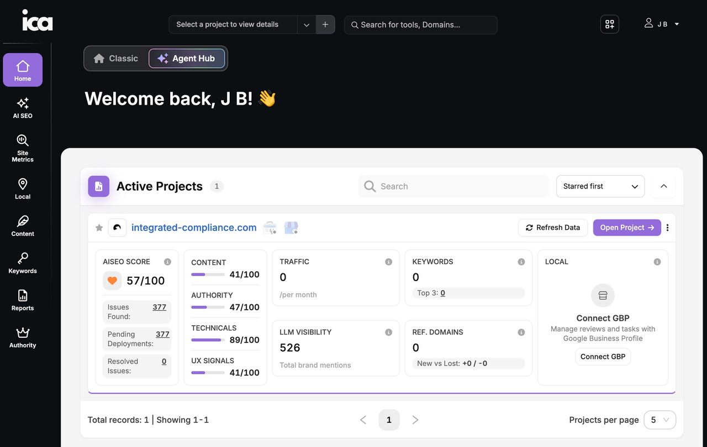

- Status: active
- Updated: 2026-01-12
- Stack: HTML, JavaScript, Operations Documentation
- Impact: Improved onboarding consistency for new client engagements and reduced setup ambiguity across service delivery.
- Details: projects/ica.md
- Visibility: Core repository is private. This entry summarizes architecture and working approach without exposing proprietary source.

### SAI Canvas

Terminal UI toolkit that gives Claude Code a dedicated canvas for interactive operations.

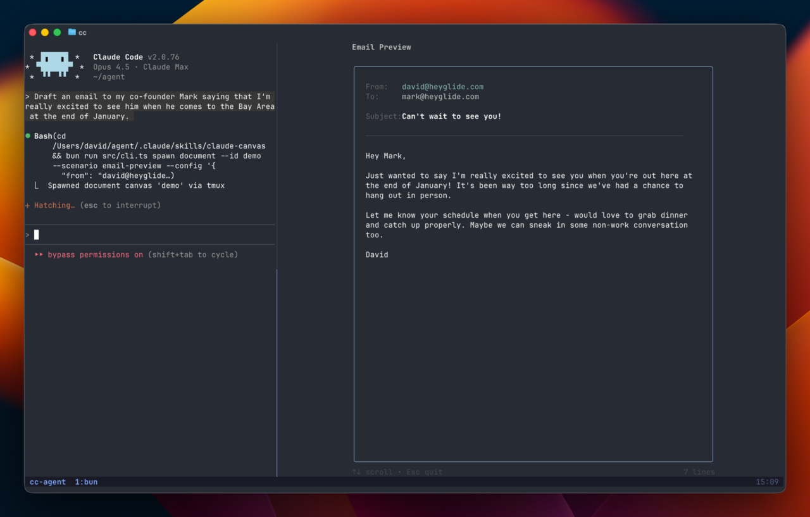

- Status: active
- Updated: 2026-01-10
- Stack: JavaScript, Bun, tmux, Terminal UI
- Impact: Improved operator visibility and interaction speed when running multi-step agent tasks in terminal-heavy workflows.
- Details: projects/sai-canvas.md
- Visibility: Core repository is private. This entry summarizes architecture and working approach without exposing proprietary source.

### Rxion v3

Third-generation front-end foundation focused on cleaner architecture and faster iteration.

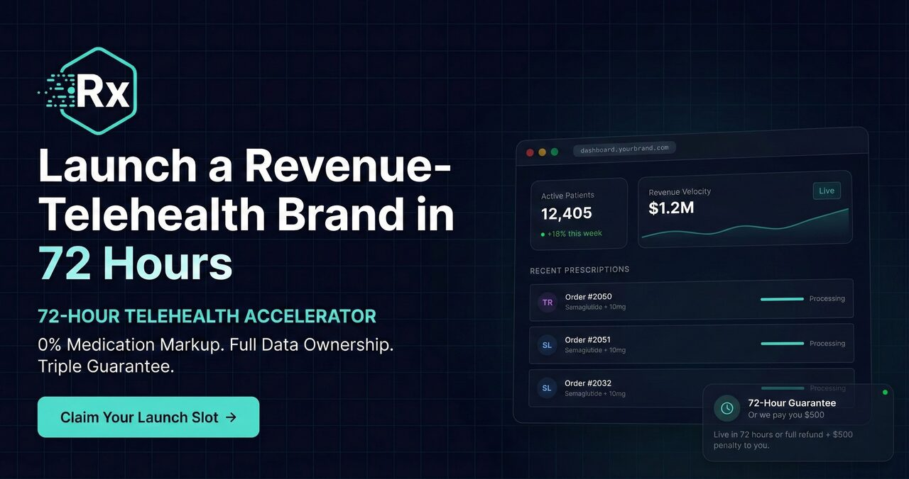

- Status: active
- Updated: 2025-11-30
- Stack: React, TypeScript, Vite
- Impact: Created a cleaner implementation surface for future product expansion with less accumulated technical friction.
- Details: projects/rxionv3.md
- Visibility: Core repository is private. This entry summarizes architecture and working approach without exposing proprietary source.

### CrossPoint Website Migration

Website migration and modernization program for CrossPoint Knightdale from Squarespace to Wix Studio.

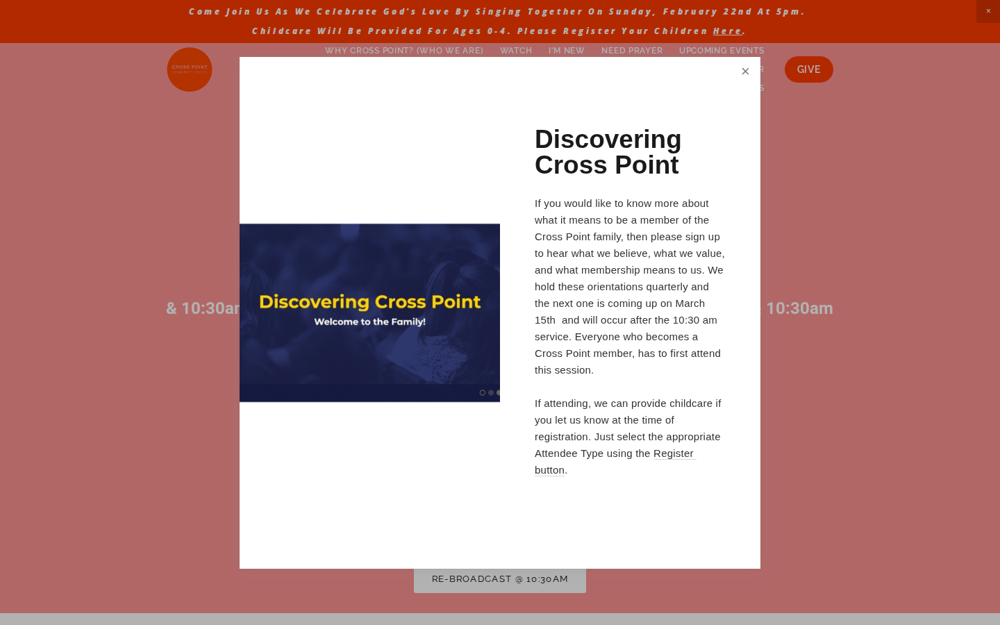

- Status: active
- Updated: 2025-11-27
- Stack: Wix Studio, JavaScript, Tailwind CSS, Alpine.js
- Impact: Created a structured migration path that lowers relaunch risk and protects existing traffic/value during platform transition.
- Demo: https://www.crosspointknightdale.com/
- Details: projects/crosspoint.md
- Visibility: Core repository is private. This entry summarizes architecture and working approach without exposing proprietary source.

### 3D Particle Manipulator

Interactive 3D particle experience used to prototype motion, camera, and behavior ideas quickly.

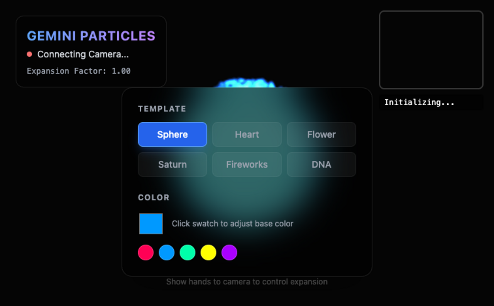

- Status: active
- Updated: 2025-11-19
- Stack: JavaScript, TypeScript, WebGL
- Impact: Reduced concept-to-demo time for interactive 3D explorations and made visual interaction decisions easier to validate early.
- Details: projects/optimialrx.md
- Visibility: Core repository is private. This entry summarizes architecture and working approach without exposing proprietary source.

### Google Ads Keyword & Bid Manager

Google Ads operations toolkit for keyword research, bid tuning, and campaign performance diagnostics.

- Status: active
- Updated: 2025-10-10
- Stack: Python, Google Ads API, OAuth2
- Impact: Improved speed and consistency of keyword/bid management decisions in Google Ads operations.
- Details: projects/google-ads-management.md
- Visibility: Core repository is private. This entry summarizes architecture and working approach without exposing proprietary source.

### CommonSenseHealth Web Prototype

Rapid health-web prototype platform for testing messaging, flows, and conversion structure.

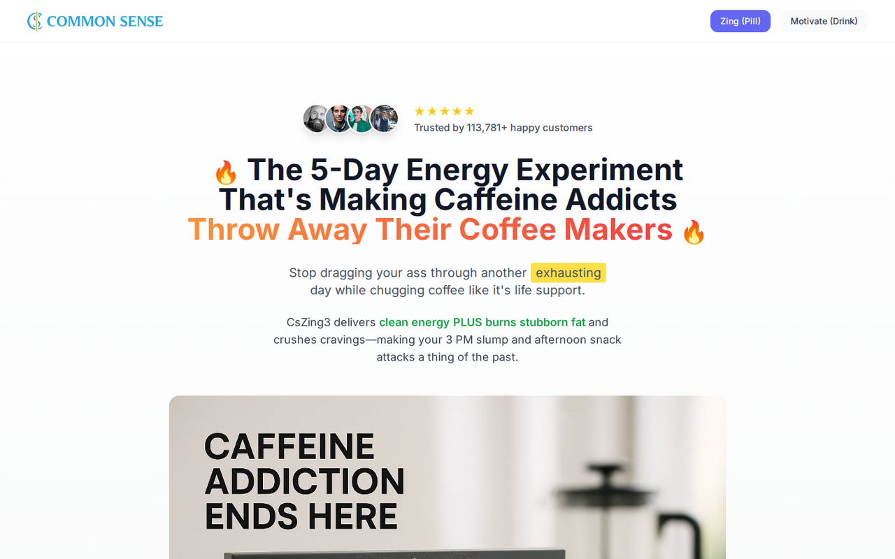

- Status: active
- Updated: 2026-02-21
- Stack: React, TypeScript, Tailwind CSS
- Impact: Accelerated health-site concept validation while keeping a maintainable implementation path.
- Demo: https://commonsensehealth.net
- Details: projects/commonsensehealth.md
- Visibility: Core repository is private. This entry summarizes architecture and working approach without exposing proprietary source.

